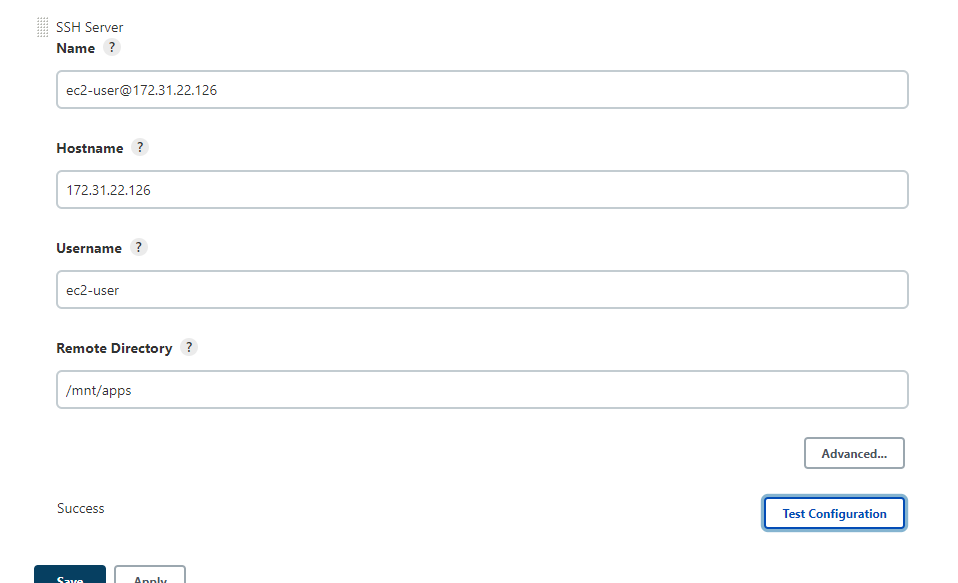

# Documentation of project 9
## Step 1
1. I created an aws ec2 ubuntu server and named it jenkins-server
  
  

2. I installed jdk

  `sudo apt update`
  `sudo apt install default-jdk-headless`
  `wget -q -O - https://pkg.jenkins.io/debian-stable/jenkins.io.key | sudo apt-key add -`
`sudo sh -c 'echo deb https://pkg.jenkins.io/debian-stable binary/ > \`
    `/etc/apt/sources.list.d/jenkins.list'`
`sudo apt update`
`sudo apt-get install jenkins`

   
   
   

3. I ensured jenkins was up and running
   
   `sudo systemctl status jenkins`
   

4.  I opened TCP port 8080 on my security group
    
5.  I confirmed the initial jenkins setup on my browser

   

6. Then I retrieved password from the server
   

7.  I installed suggested plugins
   
   
   

8. My setup was ready
    
    

## Step 2
1. I enabled webhooks in my github repository
   

2. I created a 'freestyle project' in my jenkins web console
   

 3. I configured my jenkins freestyle project
    

4.  I saved the configuration and tried to run the build
    
    
    
5. I configured 'post-build actions to archive the files'
    
    

## Step 3
1. So as to install publish over ssh, I clicked on 'manage jenkins' on the dashboard
     

2. Then I clicked on plugin Manager
      

3. It was installed successfully

     

4. Then, I configured it

   
   

5. I tested the configuration and it was successful

    

6. I confirmed it on my windows terminal and it worked

    

